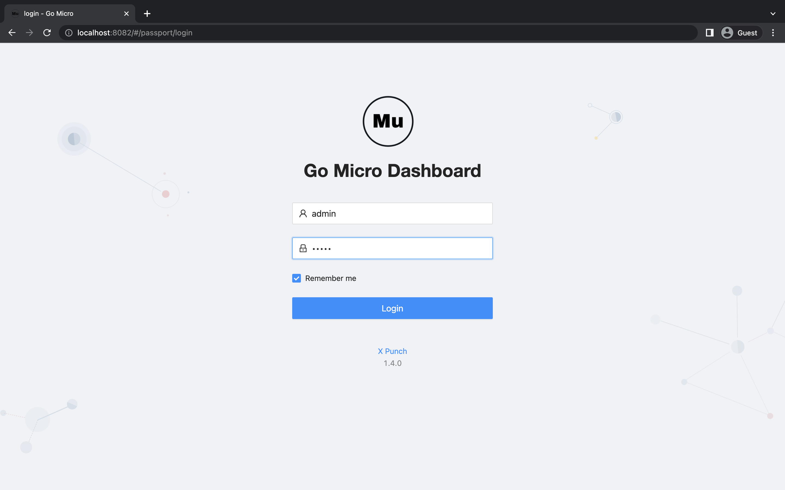
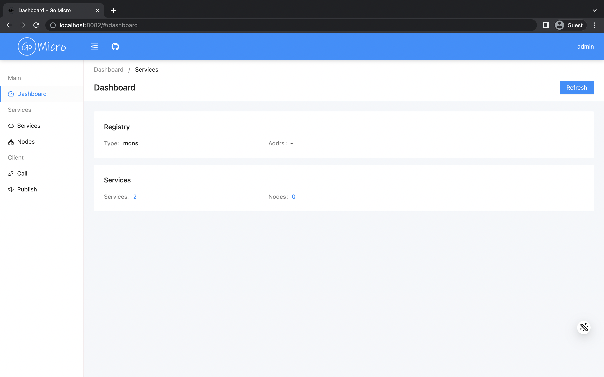
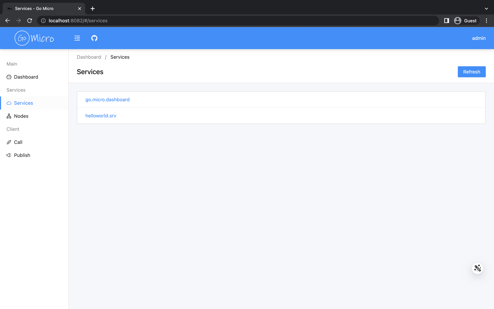
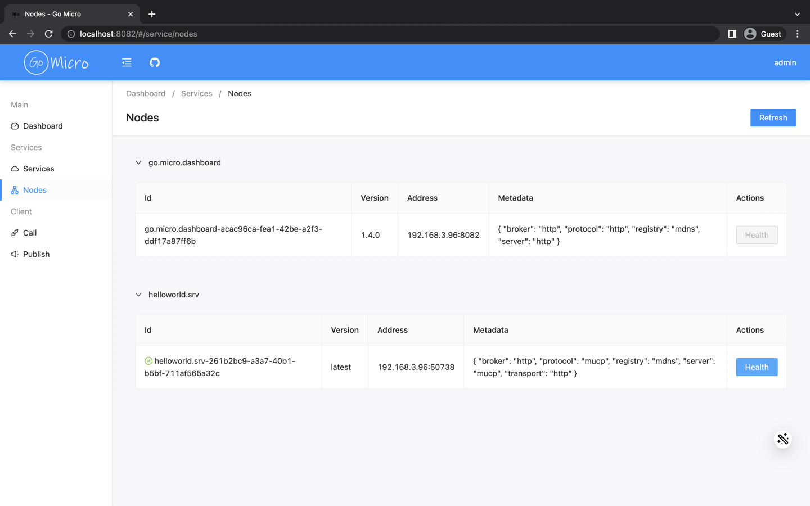
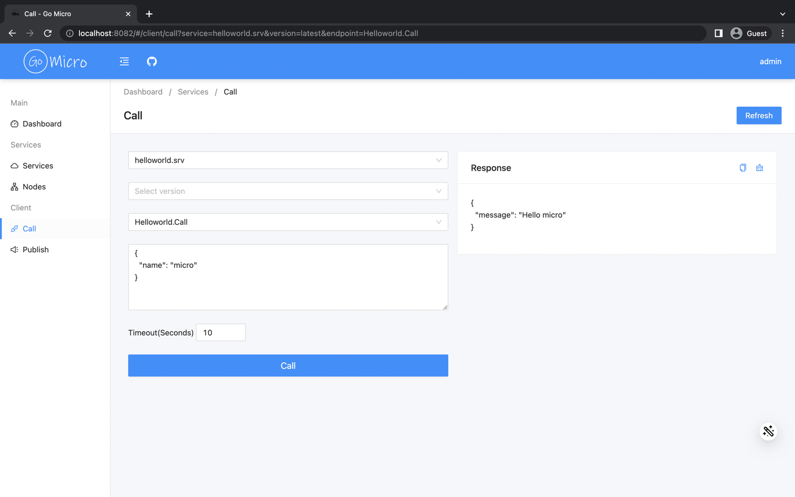

# Go Micro Dashboard [](https://godoc.org/github.com/go-micro/plugins) [](https://github.com/go-micro/dashboard/actions/workflows/ci.yml) [](https://github.com/go-micro/dashboard/actions/workflows/docker-publish.yml) [](https://hits.seeyoufarm.com) [](https://opensource.org/licenses/Apache-2.0)

Go micro dashboard is designed to make it as easy as possible for users to work with go-micro framework.

## Features

- [x] Logo
- [x] Web UI
- [x] Service discovery
  - [ ] Register service
  - [ ] Deregister service
- [x] Health check
- [ ] Configuration service
- [x] Synchronous communication
  - [x] RPC
  - [ ] Stream
- [x] Asynchronous communication
  - [x] Publish
  - [ ] Subscribe

## Installation

```
go install github.com/go-micro/dashboard@latest
```

## Development

### Server

#### Swagger

```
swagger generate spec -o docs/swagger.json -b ./docs
swag init
```

#### Config

```
default username: admin
default password: micro
```

##### ENV
```
export SERVER_ADDRESS=:8082
export SERVER_AUTH_USERNAME=user
export SERVER_AUTH_PASSWORD=pass
```

##### YAML
```
export CONFIG_TYPE=yaml
```
```yaml
server:
  env: "dev"
  address: ":8082"
  swagger:
    host: "localhost:8082"
```

##### TOML
```
export CONFIG_TYPE=toml
```
```toml
[server]
env = "dev"
address = ":8082"
[server.swagger]
host = "localhost:8082"
```

### Web UI

[Document](https://github.com/go-micro/dashboard/tree/main/frontend)

#### Generate Web Files

```
go install github.com/UnnoTed/fileb0x@latest
fileb0x b0x.yaml
```

## Docker

```
docker run -d --name micro-dashboard -p 8082:8082 xpunch/go-micro-dashboard:latest
```

## Docker Compose

```
docker-compose -f docker-compose.yml up -d
```

## Kubernetes

```
kubectl apply -f deployment.yaml
```

## Community

- [Discord](https://discord.gg/qV3HvnEJfB)
- [Slack](https://join.slack.com/t/go-micro/shared_invite/zt-175aaev1d-iHExPTlfxvfkOeeKLIYEYw)
- [QQ Group](https://jq.qq.com/?_wv=1027&k=5Gmrfv9i)

## Screen Shots







## License

[Apache License 2.0](./LICENSE)
